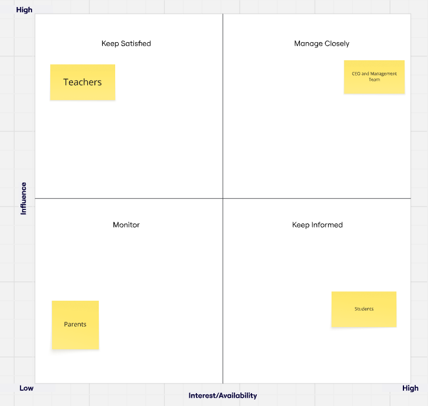

# Six-Seven Quizzes
A web-based educational role-play game for secondary school students (ages 11–16) designed to improve engagement in non-STEM subjects.

## Business Case
In the past two years, student engagement in non-STEM subjects such as History, Geography, and the Arts has decreased. Many students describe lessons as repetitive and focused mainly on textbooks. Teachers also report that students quickly forget what they learn, which shows that learning is often superficial. Parents have noticed that students feel overwhelmed by school content and enjoy learning less than before.
The Hive Foundation wants to promote a balanced and holistic education. Improving engagement in non-STEM subjects is therefore an important goal for the organisation.

Project Objective: Increase student engagement and enjoyment while supporting teachers and providing measurable educational results that meet the CEO’s strategic goals.

## Business Challenge and Solution

### Challenge: 
Traditional lessons rely on reading and memorisation. This makes it hard for students to stay motivated. Teachers struggle to make lessons interesting, and parents worry about stress and lack of enjoyment.

#### Main challenges
- Low motivation in non-STEM subjects.
- Learning is superficial and quickly forgotten
- Students feeling overloaded with content.
- Need for clear evidence of educational impact. 

### Solution Proposal
Six-Seven Quizzes is a web educational game that teaches subjects through role-play scenarios and interactive storytelling.

The platform will:
- Encourage students to participate actively in learning
- Turn lessons into stories and challenges
- Help teachers use it in class
- Give data to track student progress
- Make learning more fun and meaningful

#### Solution Analysis
The game directly addresses student disengagement by making lessons interactive.

Benefits:
- Students are more motivated and enjoy learning
- Knowledge is better remembered
- Teachers get support and tools for class use
- Parents notice students are less stressed and more interested

## Stakeholder Analysis

### Stakeholder Analysis Grid 

### Key Stakeholders

- **Client - CEO & Management Team**
**High Power / High Interest:** 
This group provides the money and makes the final decisions. They will only continue the project if it clearly shows value and helps students learn effectively.
Management: regular reporting, milestone reviews, and outcome-focused communication.

- **Teachers**
**Medium Power / High Interest**
They do not provide the funding, but they are very influential. If they choose not to use the platform in their classrooms, the project will fail because no one will adopt it.
Management: involve teachers in design, provide training, and respond to feedback.

- **Parents**
**Medium Power / High Interest**
They do not have direct power over how the project is built. However, their support is very important for the project to succeed in the long term.
Management: communicate benefits clearly and provide transparent progress information.

- **Students (End Users)**
**Low Power / High Interest**
They are the ones who will use the platform every day. Even though they are the main users, they do not have the official power to change the project’s budget or main goals.
Management: focus on user-centred design, testing, and continuous feedback.

