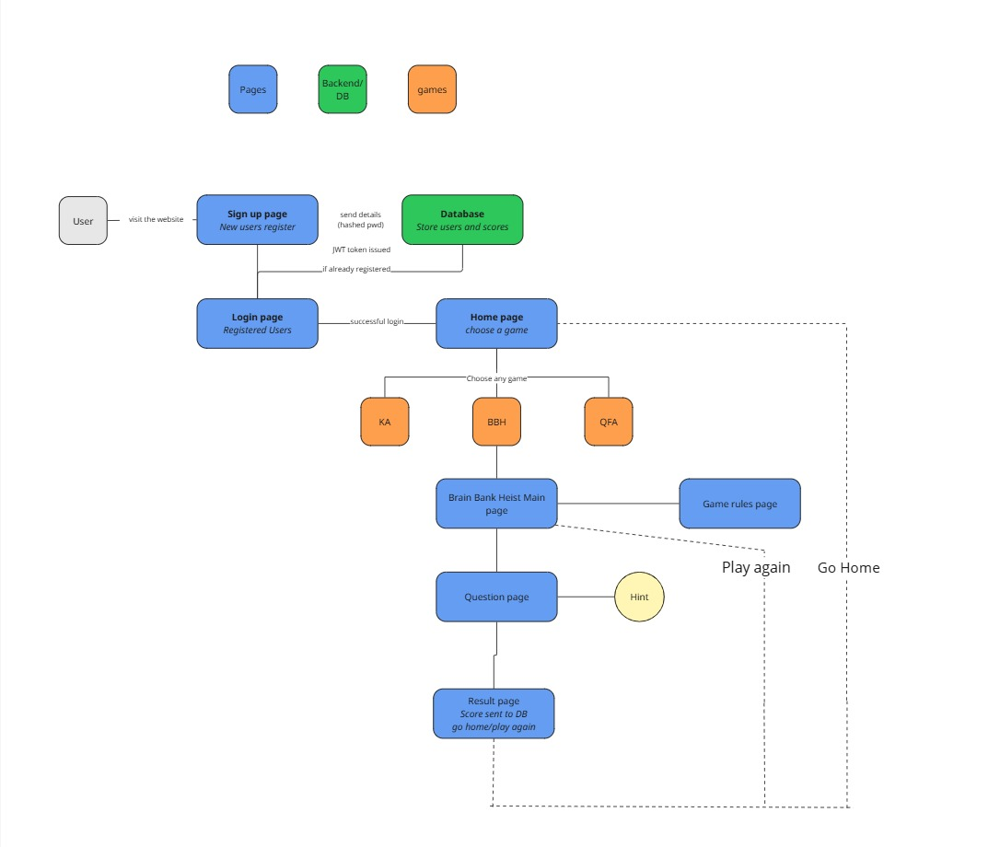
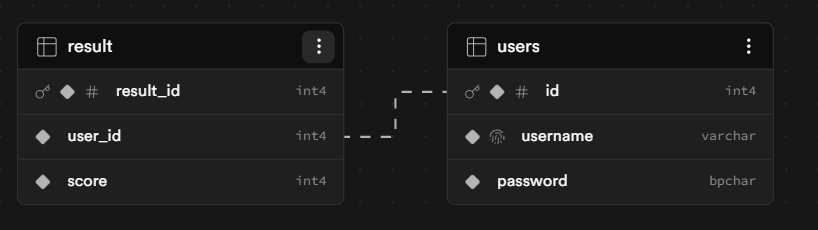

# System Archieture & Design 

## High-Level Solution Diagram
Our project has three main parts that work together to make the game fun and fast for students

- The Frontend: HTML,CSS and JavaScript to maximise student enjoyment 
- The Backend: Node.js and Express API handle the authorisation 
- The Database: Relational SQL database hosted via Supabase (postgreSQL) to store student's credentials and their game scores

## Database Schema (ERD)
Our Database is designed to support signup/login system and track student' score across the different games

### Key Entities
- Results: stores the score for 
- Users: stores hashed credentials

### Wireframes
Following the Hive Foundation's goal of a "well-rounded, holisitc education", our wireframes prioritise a "fun" interface to move away from the textbook reported by the students. Our goal was:
- to make it fun so students want to play 
- to make it simple and easy to use

check our wireframes in [the wireframes folder](./wireframes)
[trello](https://trello.com/b/3UsAbofl/educational-game-app)
